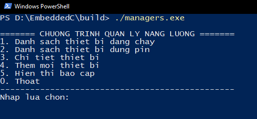

# Project_N9
Bài tập lớn nhóm 9 

# Minh họa
    

# Tính năng
    Mô phỏng chương trình quản lý năng lượng trong các văn phòng thông minh
    
    Các tính năng hiện có:
    - Hiển thị danh sách thiết bị đang chạy
    = Hiển thị đanh sách thiết bị dùng pin
    = Hiển thị thông tin thiết bị đã có
    = Thêm mới thiết bị
    = Hiển thị báo cáo

# Sử dụng 
    Tải về, giải nẻn rồi mở CMD tại thư mục build: 
    - Chạy lệnh ./managers.exe với môi trường Windows
    - Chạy lệnh ./managers với môi trường Linux hay MacOS (Đang phát triển)

# Phát triển
    Chương trình sử dụng Visual Studio Code và CMake đã được cấu hình.
    Chương trình biên dịch hiện là GCC
    - MSYS2 với môi trường Windows
    - GNU Toolchain với môi trường Linux;
# Cấu trúc
    Dự án bao gồm các thư mục sau:
    - .vscosde: Cấu hình chp Visual Studio Code và CMake
    - build: Chứa bản dựng của chương trình
    - docs: Chứa tài liệu dự án
    - inc: Chứa các tệp header
    - src: Chưa mẫ nguồn
    - test: Chưa tệp dữ liệu để kiểm thử
    - make: Thư mực tạm thời khi biên dịch. Nên xóa đi khi gặp lỗi.